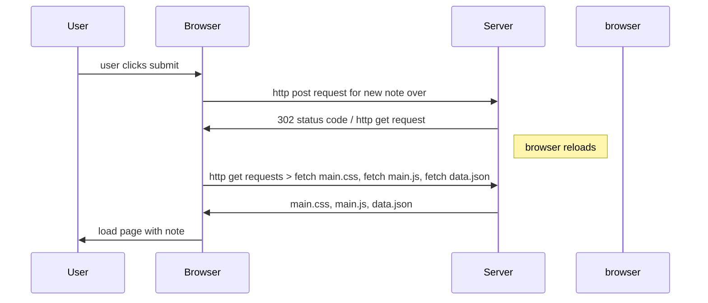

```mermaid
sequenceDiagram
User->>Browser: user clicks submit
Browser->>Server: http post request for new note over
Server->>Browser: 302 status code / http get request
note left of browser: browser reloads
Browser->>Server: http get requests > fetch main.css, fetch main.js, fetch data.json
Server->>Browser: main.css, main.js, data.json
Browser->>User: load page with note
```
