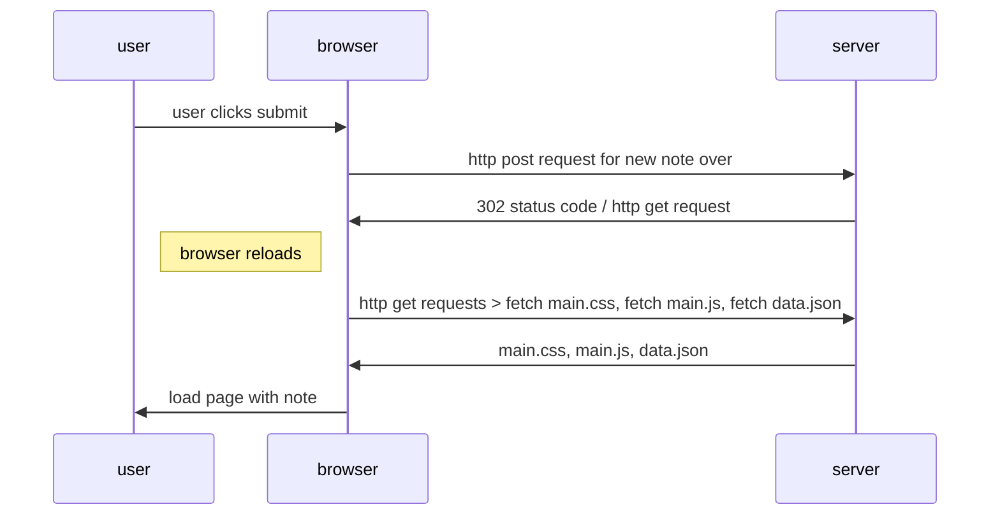

```mermaid
sequenceDiagram
user->>browser: user clicks submit
browser->>server: http post request for new note over
server->>browser: 302 status code / http get request
note left of browser: browser reloads
browser->>server: http get requests > fetch main.css, fetch main.js, fetch data.json
server->>browser: main.css, main.js, data.json
browser->>user: load page with note
```
