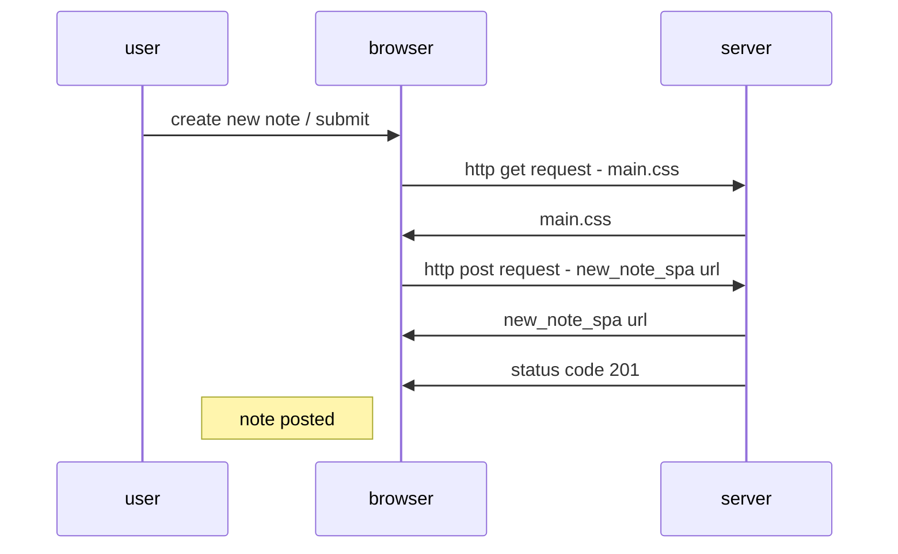

```mermaid
sequenceDiagram
user->>browser: create new note / submit 
browser->>server: http get request - main.css
server->>browser: main.css
browser->>server: http post request - new_note_spa url
server->>browser: new_note_spa url
server->>browser: status code 201 
note left of browser: note posted
```
